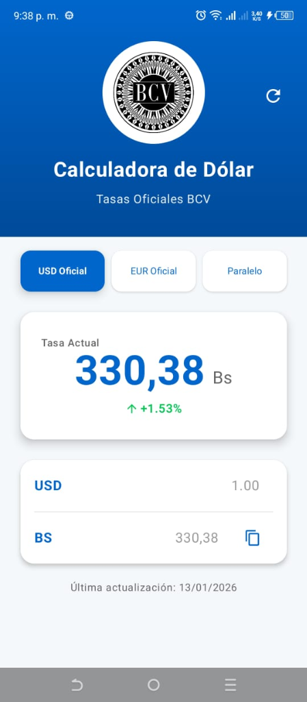
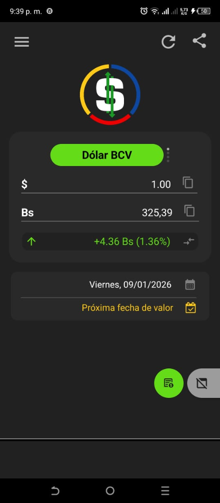

# Dólar BCV - Calculadora de Tasas

**Dólar BCV** es una aplicación Android intuitiva y eficiente diseñada para mantenerte al día con las tasas de cambio en Venezuela. Con un enfoque en la simplicidad y la precisión, esta herramienta es esencial para cualquier persona que necesite realizar conversiones rápidas entre Bolívares (Bs) y Dólares ($) utilizando las tasas oficiales y del mercado.

## Galeria y Comparativa

Nuestro objetivo es ofrecer una experiencia de usuario superior, limpia y sin interrupciones, en contraste con otras opciones del mercado saturadas de publicidad.

| Nuestra App (Dólar BCV) | Referencia de Mercado |
|:-----------------------:|:---------------------:|
|  |  |
| **Diseño limpio, sin publicidad intrusiva y enfoque en la usabilidad.** | *Ejemplo de aplicaciones existentes que buscamos mejorar, evitando la saturación visual.* |

## Características Principales

* **Tasa Oficial BCV:** Obtén la tasa de cambio actualizada directamente del Banco Central de Venezuela.
* **Tasa Paralela:** Consulta referencias del mercado paralelo para un panorama completo.
* **Calculadora Integrada:** Realiza conversiones instantáneas con una interfaz unificada.
  * Conversión bidireccional (Bs <-> $).
  * Copia rápida de resultados al portapapeles.
* **Interfaz Profesional:** Diseño moderno y libre de distracciones.

## Tecnologías Utilizadas

* **Lenguaje:** Kotlin
* **Plataforma:** Android (Nativo)
* **UI:** Jetpack Compose

## Instalación y Uso

1. **Clonar el repositorio:**

    ```bash
    git clone https://github.com/tu-usuario/android-dolar-bcv.git
    ```

2. **Abrir en Android Studio:**
    * Inicia Android Studio.
    * Selecciona "Open an existing Android Studio project".
    * Navega hasta la carpeta clonada.
3. **Compilar y Correr:**
    * Conecta tu dispositivo Android o inicia un emulador.
    * Haz clic en el botón de "Run".

## Licencia

´
